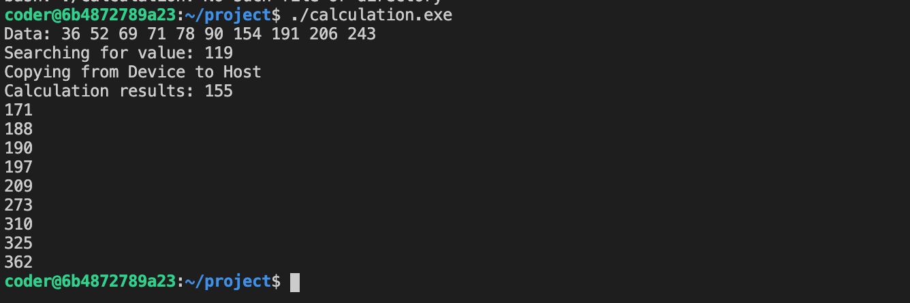

# Lab Instructions

1. Develop calculation code inside of calculation kernel in calculation.cu.
2. Run make clean build
3. Execute code via ./calculation.exe

The compiled executable has the following positional arguments (meaning the order matters and an option cannot be skipped):

`calculation.exe true|false threadsPerBlock numElements searchValue inputFilename`

The true|false is used to denote if there is interest in sorting the input data, either randomly generated or via input file.

# Results

